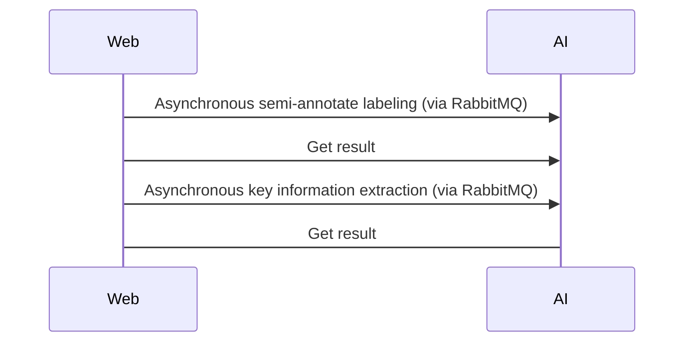
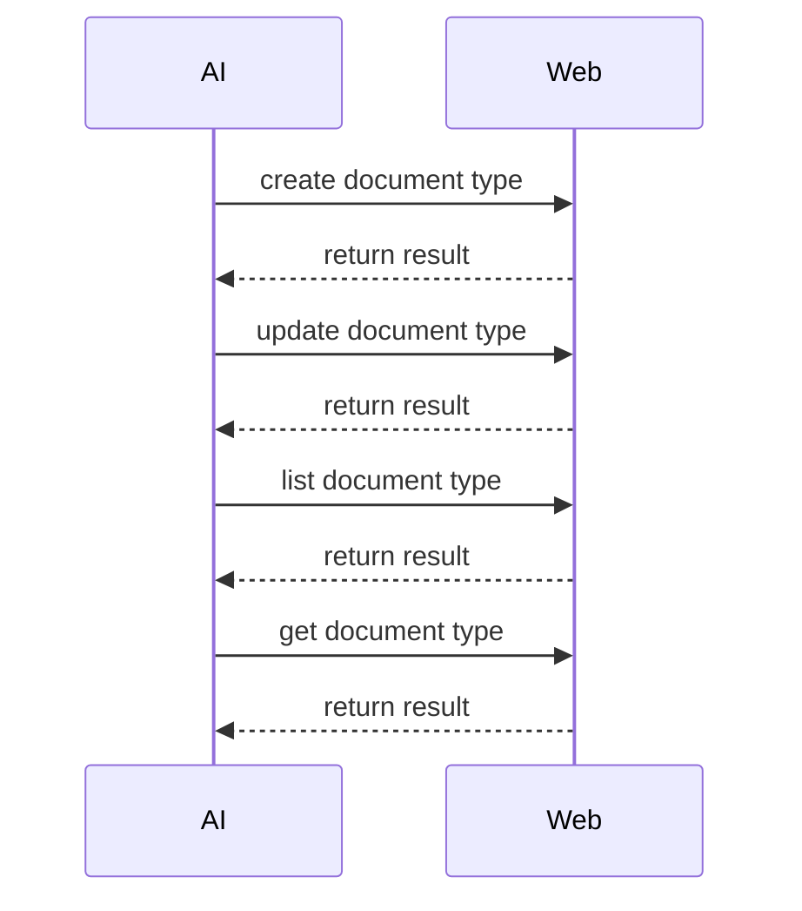

# :exclamation: REST API Web Backend to AI Backend




## :fire:  Asynchronous Semi-annotate Labeling
After creating a new document type, we need to provide semi-annotated labels for the new training data. This process shortens human labeling time. Basically, it is the same as **Asynchronous Key Information Extraction** process, however, we add **Form Extraction** for basic understanding of some additional form fields, not provided by the base document type.  The training process is to create **Key Information Extraction** model, and post-processing rules.

### :arrow_right: Request Structure

|Field Name|Type|Description|
|--|--|--|
||||

### :arrow_left: Request Structure

|Field Name|Type|Description|
|--|--|--|
||||

## :fire: Asynchronous Key Information Extraction
After training successfully, the **AI Backend** will have sufficient AI models and post-processing rules for a full pipeline of intelligence document processing. 

### :arrow_right: Request Structure

|Field Name|Type|Description|
|--|--|--|
|document_type|[DocumentType](#documenttype)|Document Type detail|

### :arrow_left: Request Structure

|Field Name|Type|Description|
|--|--|--|
|text_extraction|JSON|The raw text extracted from a document.|
|form_extraction|JSON|Form data extraction with specific fields. They are represented as key-value pair.|
|table_extraction|JSON|Table extraction with specific fields. They are seperated and matched base on column header.|
		
# :exclamation: REST API AI Backend to Web Backend



## :fire: Create Document Type

|Endpoint|HTTP Method|
|--|--|
|2.0/idp/document_type/create|POST|

### :arrow_right: Request Structure

|Field Name|Type|Description|
|--|--|--|
||||

### :arrow_left: Request Structure

|Field Name|Type|Description|
|--|--|--|
||||

## :fire: Update Document Type

|Endpoint|HTTP Method|
|--|--|
|2.0/idp/document_type/create|POST|

### :arrow_right: Request Structure

|Field Name|Type|Description|
|--|--|--|
||||

### :arrow_left: Request Structure

|Field Name|Type|Description|
|--|--|--|
||||

## :fire: List Document Type

|Endpoint|HTTP Method|
|--|--|
|2.0/idp/document_type/create|POST|

### :arrow_right: Request Structure

|Field Name|Type|Description|
|--|--|--|
||||

### :arrow_left: Request Structure

|Field Name|Type|Description|
|--|--|--|
||||

## :fire: Get Document Type

|Endpoint|HTTP Method|
|--|--|
|2.0/idp/document_type/create|POST|

### :arrow_right: Request Structure

|Field Name|Type|Description|
|--|--|--|
||||

### :arrow_left: Request Structure

|Field Name|Type|Description|
|--|--|--|
||||

# :exclamation: Data Structure

## :fire:  DocumentType

Document type

| Field Name | Type | Description |
|--|--|--|
| document_type_id | STRING | Unique identifier for the document type |
| tenant_id | STRING | Unique identifier for the tenant. ```global``` if this document type is created by **AI Backend**. 
| base_document_type_id | STRING | Use the base document type for quick setup and semi-automatic labeling. |
| name | STRING | Human readable name that identifiers the document type |
| public | BOOL | Current public stasge of the doåcument. If the documents is own by **AI Backend** and also be public, other user can apply it for their own pipeline.  |
| language | STRING | Primary language of this document type. |
| ocr_engine | STRING | OCR Engine to applied for this document type. |
| form_fields | An array for [FormField](formfield) | Metadata for form fields. **Note** that the form field name must be unique per document type. |
| table_fields | An array for [TableField](tablefield) | Metadata for table field. **Note** that the table field 
| last_update_time | INT64 | Last update time. |
| creation_time | INT64 | Creation time. |

## :fire: FormFields

Form field for extraction

| Field Name | Type | Description |
|--|--|--|
| name | STRING | Unique identifier for the form field. |
| alias | an array of STRING | A list of alias texts for the field label. |
| data_type | STRING | Data type for validation. |
| required | BOOL | True if this field is required. |
| starts_with | STRING | The validation rule starts with . |
| ends_with | STRING | The validation rule ends with . |
| pattern | STRING | A pattern helps define an acceptable format for data. |
| logic_code | STRING | Python logic code for post-processing. |

## :fire: TableFields

Table field for extraction

| Field Name | Type | Description |
|--|--|--|
| name | STRING | Unique identifier for the table field. |
| alias | an array of STRING | A list of alias texts for the column name. |
| data_type | STRING | Data type for validation. |
| required | BOOL | True if this field is required. |
| starts_with | STRING | The validation rule starts with. |
| ends_with | STRING | The validation rule ends with. |
| pattern | STRING | A pattern helps define an acceptable format for data. |
| logic_code | STRING | Python logic code for post-processing. |
