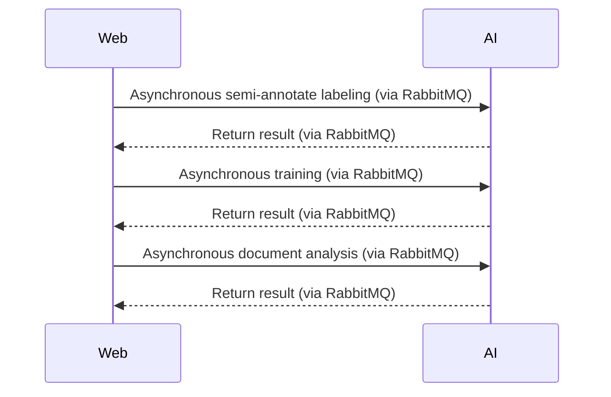
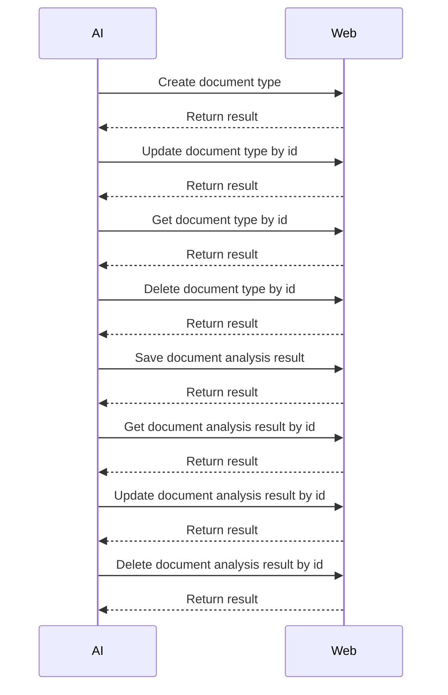
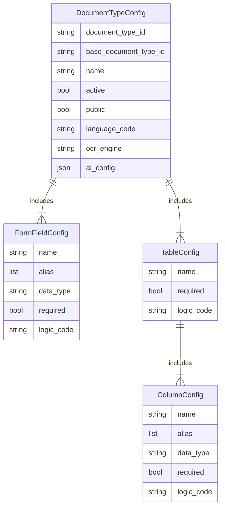

# :exclamation: Asynchronous API Web Backend to AI Backend




## :fire:  Asynchronous Semi-annotate Labeling
After creating a new document type, we need to provide semi-annotated labels for the new training data. This process shortens human labeling time. Basically, it is the same as **Asynchronous Key Information Extraction** with AI model and post-processin rules from the base document type.

### :arrow_right: Request Structure

|Field Name|Type|Description|
|--|--|--|
|request_id| STRING | The unique identifier for the request.|
|document_type|[DocumentType](#fire-documenttype)|Document Type detail.|
|url| STRING | URL to the document need to apply automatic semi-labelling. |
|output_queue_name | STRING | Output queue name to store the return result.|

### :arrow_left: Response Structure

|Field Name|Type|Description|
|--|--|--|
|request_id|STRING|The unique identifier for the request.|
|status|STRING|The status of request, success or fail.|
|document_analysis_id|STRING|The unique identifier for the document analysis result.|

## :fire: Asynchronous Training

### :arrow_right: Request Structure

|Field Name|Type|Description|
|--|--|--|
|request_id| STRING | The unique identifier for the request.|
|document_type|[DocumentType](#fire-documenttype)|Document Type detail.|
|document_analysis_ids|An array of STRING| A list of document analysis id. |

### :arrow_left: Response Structure

|Field Name|Type|Description|
|--|--|--|
|request_id|STRING|The unique identifier for the request.|
|status|STRING|The status of request, success or fail.|
|accuracy|FLOAT|The average accuracy of model on the training data.|

## :fire: Asynchronous Document Analysis
After training successfully, the **AI Backend** will have sufficient AI models and post-processing rules for a full pipeline of intelligence document processing. 

### :arrow_right: Request Structure

|Field Name|Type|Description|
|--|--|--|
|request_id|STRING|Unique identifier for each request.|
|document_type|[DocumentType](#fire-documenttype)|Document Type detail.|
|url|STRING|S3 url to the document.|
|output_queue_name|STRING|Output queue name to store the return result.|

### :arrow_left: Response Structure

|Field Name|Type|Description|
|--|--|--|
|document|[DocumentAnalysis](#fire-document-analysis)||
|text_extraction|JSON|The raw text extracted from a document.|
|form_extraction|JSON|Form data extraction with specific fields. They are represented as key-value pair.|
|table_extraction|JSON|Table extraction with specific fields. They are seperated and matched base on column header.|
		
# :exclamation: REST API AI Backend to Web Backend



## :fire: Create Document Type

|Endpoint|HTTP Method|
|--|--|
|2.0/idp/document_type/create|POST|

### :arrow_right: Request Structure

|Field Name|Type|Description|
|--|--|--|
| name | STRING | Human readable name that identifiers the document type. This name must be unique in each tenant. | description | STRING | Description for this document type. |
| base_document_type_id | STRING | The identifier of the base document type for quick set-up and automatic semi-labeling. |
|language_code|STRING|Primary [language code](http://www.lingoes.net/en/translator/langcode.htm) for this document type.|
| ocr_engine | STRING | OCR Engine to applied for this document type. |
| form_fields | An array for [FormField](formfield) | Metadata for form fields. **Note** that the form field name must be unique in each document type. |
| tables | An array for [Table](table) | Configuration for table. **Note** that the table name must be unique in each document type.) |
| ai_config | JSON | Config for **AI Backend** |


### :arrow_left: Response Structure

|Field Name|Type|Description|
|--|--|--|
| document_type | [DocumentType](#fire-documenttype) | Document Type Object.  |

## :fire: Update Document Type by id

|Endpoint|HTTP Method|
|--|--|
|2.0/idp/document_type/update|POST|

### :arrow_right: Request Structure

|Field Name|Type|Description|
|--|--|--|
| document_type_id | STRING | Unique identifier for the document type. |
| description |STRING|Description for this document type.|
| active | BOOL | Current active status of the document. If true, user in the same tenant can use this document type. |
| public | BOOL | If the document type is public, all user can apply it for their own pipeline. This option is only available for the **AI Team** to create global base model.  |
| form_fields | An array for [FormField](formfield) |  for form fields. **Note** that the form field name must be unique in each document type. |
| tables | An array for [Table](table) | Configuration for table. **Note** that the table name must be unique in each document type.) |
| ai_config | JSON | Config for **AI Backend** |


### :arrow_left: Response Structure

|Field Name|Type|Description|
|--|--|--|
| document_type | [DocumentType](#fire-documenttype) | Document Type Object.  |


## :fire: Get Document Type by id

|Endpoint|HTTP Method|
|--|--|
|2.0/idp/document_type/get|POST|

### :arrow_right: Request Structure

|Field Name|Type|Description|
|--|--|--|
| document_type_id | STRING | Unique identifier for the document type. |

### :arrow_left: Response Structure

|Field Name|Type|Description|
|--|--|--|
| document_type | [DocumentType](#fire-documenttype) | Document Type Object.  |

## :fire: Delete Document Type by id

|Endpoint|HTTP Method|
|--|--|
|2.0/idp/document_type/delete|POST|

### :arrow_right: Request Structure

|Field Name|Type|Description|
|--|--|--|
| document_type_id | STRING | Unique identifier for the document type. |


# :exclamation: Data Structure


 
## :fire:  DocumentTypeConfig

Document type config

| Field Name | Type | Description |
|--|--|--|
| document_type_id | STRING | Unique identifier for the document type. |
| tenant_id | STRING | Unique identifier for the tenant. |
| base_document_type_id | STRING | The identifier of the base document type for quick set-up and automatic semi-labeling. |
| name | STRING | Human readable name that identifiers the document type. This name must be unique in each tenant. |
| active | BOOL | Current active status of the document. If true, user in the same tenant can use this document type. |
| public | BOOL | If the document type is public, all user can apply it for their own pipeline. This option is only available for the **AI Team** to create base model.  |
| language_code | STRING | Primary [language code](http://www.lingoes.net/en/translator/langcode.htm) for this document type. |
| ocr_engine | STRING | OCR Engine to applied for this document type. |
| form_field_configs | An array for [FormField](formfield) | A list of configurations for mutiple form fields. **Note** that the form field name must be unique in each document type. |
| table_configs | An array for [Table](table) | A list of configurations for multiple tables. **Note** that the table name must be unique in each document type.) | 
| ai_config | JSON | Config for **AI Backend** |
| last_update_time | INT64 | Last update time. |
| creation_time | INT64 | Creation time. |

## :fire: FormFieldConfig

Form field

| Field Name | Type | Description |
|--|--|--|
| name | STRING | Unique identifier for the form field. |
| alias | an array of STRING | A list of alias texts for the field label. |
| data_type | STRING | Data type for validation. |
| required | BOOL | True if this field is required. |
| logic_code | STRING | Python logic code for post-processing. |

## :fire: TableConfig

Table

| Field Name |  Type | Description |
|--|--|--|
| name | STRING | Unique identifier for the table. |
| required | BOOL | True if this field is required. |
| logic_code | STRING | Python logic code for post-processing. |
| column_configs | An array for [ColumnConfig](#fire-columnconfig) | A list of configurations for multiple table columns.  **Note** that the table column name must be unique in each table. |

## :fire: ColumnFieldConfig

Column field config

| Field Name | Type | Description |
|--|--|--|
| name | STRING | Unique identifier for the table column. |
| alias | an array of STRING | A list of alias texts for the column header label. |
| data_type | STRING | Data type for validation. |
| required | BOOL | True if this field is required. |
| logic_code | STRING | Python logic code for post-processing. |

```mermaid
erDiagram  
 Document ||--|{ Page: includes
 Page ||--o{ TextBox: includes
 Page ||--o{ Form: includes
 Page ||--o{ Table: includes
 Form ||--|| Label: includes
 Form ||--|| Value: includes
 Table ||--|{ Column: includes
 Column ||--|| Label: includes
 Column ||--|{ Value: includes
 Label ||--|{ TextBox: includes
 Value ||--|{ TextBox: includes

Document {
	string document_id
	string document_type_id
	string path
}

Page {
	int width
	int height
	string class
}

Form {
	string name
	float confidence
}

Table {
	string name
	float confidence
}

Column {
	string name
}

TextBox {
	float xmin
	float ymin
	float xmax
	float ymax
	string text
	float confidence
}

Label{
	float xmin
	float ymin
	float xmax
	float ymax
	float confidence
}

Value{
	float xmin
	float ymin
	float xmax
	float ymax
	float confidence
}
 ```
 
## :fire: Document

Document

| Field Name | Type | Description |
|--|--|--|
| document_id | STRING | Unique identifier for the document. |
| document_type_id | STRING | Unique identifier for the document type. |
| version | STRING  | Document analysis model version. |
| path | STRING | Path of the original document. |
| pages | An array of [PageAnalysis](#fire-pageanalysis) | A list of page data. |

## :fire: Page

Page

| Field Name | Type | Description |
|--|--|--|
| width | INT64 | Width of the page image. |
| height | INT64 | Height of the page image. |
| class | STRING | Classification result of the page. |
| text_extraction | An array of [TextExtraction](#fire-textextraction) | A list of text extraction result. |
| form_extraction | An array of [FormExtraction](#fire-formextraction) | A list of form extraction result. |
| table_extraction | An array of [TableExtraction](#fire-tableextraction) | A list of table extraction result. |

## :fire: TextBox

Text box

| Field Name | Type | Description |
|--|--|--|
| text_boxes | An array of [TextBox](#fire-textbox) | Text content |

## :fire: Form

Form

| Field Name | Type | Description |
|--|--|--|
| name | STRING | Unique identifier for the form field. |
| label | [Label](#fire-label) | Form field label.  |
| value | [Value](#fire-value) | Form field value. |

## :fire: Table

Table

| Field Name | Type | Description |
|--|--|--|
| name | STRING | Unique identifier for the table. |
| columns | An array of [Column](#fire-column) | A list of columns in the table. |

## :fire: Column

| Field Name | Type | Description |
|--|--|--|
| name | STRING | Unique identifier for the form field. This could be NONE if the column does not need for extraction. |
| label | [Label](#fire-label) | Column header.  |
| values | An array of [Value](#fire-value) | Column values. |

## :fire: TextBox

| Field Name | Type | Description |
|--|--|--|
| xmin | FLOAT | Coordinate. |
| ymin | FLOAT | Coordinate. |
| xmax | FLOAT | Coordinate. |
| ymax | FLOAT | Coordinate. |
| text | STRING | Text value. |

## :fire: Label

| Field Name | Type | Description |
|--|--|--|
| xmin | FLOAT | Coordinate. |
| ymin | FLOAT | Coordinate. |
| xmax | FLOAT | Coordinate. |
| ymax | FLOAT | Coordinate. |
| text_boxes | An array of [TextBox](#fire-textbox) | Text content |

## :fire: Value

| Field Name | Type | Description |
|--|--|--|
| xmin | FLOAT | Coordinate. |
| ymin | FLOAT | Coordinate. |
| xmax | FLOAT | Coordinate. |
| ymax | FLOAT | Coordinate. |
| text_boxes | An array of [TextBox](#fire-textbox) | Text content |
